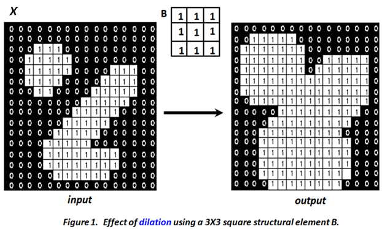

Set- theory basics

Let A and B be sets with elements a Î A, and b Î B respectively and let x be a vector.

The Complement of A is defined as Ac = {d | dÏA}

The Difference between two sets A and B is defined as D = A-B = {d|d ÎA, d ÏB} = A ÇBc

The Translation of A by x is defined as Ax = {a + x | " a Î A}

The Reflection of A is defined as -B = {-b | " b Î B}

In the following, a structural element is denoted by set B.

Dilation

The Dilation of X by B is defined as X B = {x | -Bx Ç X ¹ f}

The result of dilation is a set of all locations x such that -Bx has at least 1 pixel within X.

The dilation operation enlarges /expands the objects in the image. It connects objects separated by a distance less the width (window size) of the structuring element. Figure 1 shows the output obtained using 3X3 square structuring element (whose local origin is at the centre of the mask). It can be seen that the there is an expansion in the object size and the gap between two different connected component gets filled.

Erosion:

The Erosion of X by B is defined as X B = {x | Bx Í X}

The erosion is a set of all locations x such that the structuring element B is within (contained in) X.

In contrast to the dilation operation, erosion decreases the size of the object. Therefore the size of the foreground pixels represented using white pixels shrink in size and hole within those regions become larger. Figure 2 illustrates results of erosion applied on the example image with the same structuring element.

**Opening:**

By combining erosion with dilation as below

we define a new operation called opening. The opening operation smoothes objects. An alternate definition for opening is

The opening operation generally smoothes the boundary of the object, breaks narrow bands connecting two large foreground regions and eliminates thin bulges appear on the object boundary. Figure 3 illustrates few such cases.

**Closing:**

By reversing the ordering of erosion and dilation operations, a closing operation is defined:

Closing smoothes objects by adding pixels. All smoothing (both for closing and opening) is in relation to the size of the structuring element B.

The closing operation tends to smooth the section of boundaries but as opposed to opening, it generally fuses narrow breaks and long thin gulfs, eliminates small holes smaller the size of B, and fills gaps in the boundary. Figure 4 highlights results of closing on an example image illustrating effect of closing operation.

**Choice of structuring element**

A key difference between linear filtering, which is also a neighbourhood operation, and morphological processing is that the mask operation is defined in the latter using set theory. The other is the choice of shape. While a square shape dominates linear filtering, the shape of the structuring element is variable and is usually empirically determined based on the application or type of images. Generally, the desirable shape of a structuring element depends on the geometric shape of interest in the image. For instance, a typical medical image contains very few straight lines or objects therefore circular structural element is preferred over oriented structuring element. In contrast, aerial images usually contain oriented objects such as building, roads, etc. therefore oriented or rectangle structuring elements are preferred to better deal with such shapes. The size of the structuring element is determined based on the size of the feature of interest in the image. To preserve larger objects (features) a large structure element is preferred while a small one is used to preserve the finer structural details in the image.

**Extension to gray-scale images:**

Morphological operations are extendable for gray scale images. In a binary image, the morphological operation is based on set theory. Hence, one can view the ‘fit’ between B and object X as set intersection.

In grey scale images with pixel values are drawn from 0, 1….L-1 levels. Hence, morphological processing of grey scale images is based on extrema operations. Thus, the output pixel value at any point in a gray-scale image is determined by taking a maximum for dilation or minimum for erosion of the neighborhood pixel values.