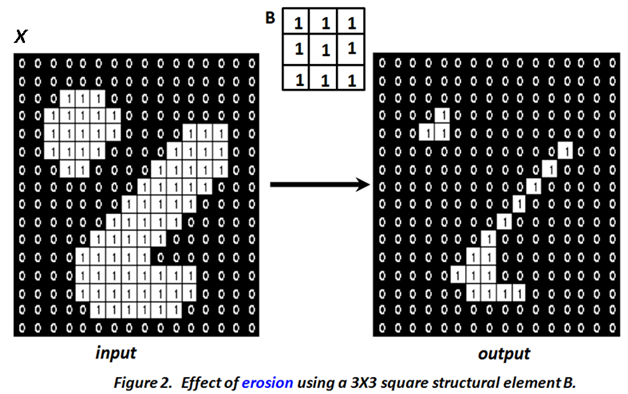

## Set Theory Basics

Let A and B be sets with elements a ∈ A and b ∈ B, respectively, and let **x** be a vector.

### Complement
The complement of A is defined as:
Ac = {d | d ∉ A}

### Difference
The difference between two sets A and B is defined as:
D = A - B = {d | d ∈ A, d ∉ B} = A ∩ Bc

### Translation
The translation of A by **x** is defined as:
Ax = {a + **x** | a ∈ A}

### Reflection
The reflection of B is defined as:
-B = {-b | b ∈ B}

### Dilation
The dilation of X by B is defined as:
X ⊕ B = {x | (-B)x ∩ X ≠ ∅}

The result of dilation is a set of all locations **x** such that (-B)x has at least one pixel within X.

The dilation operation enlarges or expands objects in the image. It connects objects separated by a distance less than the width (window size) of the structuring element. Figure 1 shows the output obtained using a 3×3 square structuring element (whose local origin is at the center of the mask). It can be seen that there is an expansion in object size, and the gap between two different connected components gets filled.

### Erosion
The erosion of X by B is defined as:
X ⊖ B = {x | Bx ⊆ X}

Erosion produces a set of all locations **x** such that the structuring element B is within (contained in) X.

In contrast to dilation, erosion decreases the size of objects. Therefore, the size of the foreground pixels (represented by white pixels) shrinks, and holes within those regions become larger. Figure 2 illustrates results of erosion applied to an example image with the same structuring element.

### Opening
By combining erosion and dilation as follows:
X ∘ B = (X ⊖ B) ⊕ B

We define a new operation called **opening**. An alternate definition for opening is:
X ∘ B = ⋃ {Bx | Bx ⊆ X}

The opening operation smooths objects. It breaks narrow bands connecting two large foreground regions and eliminates thin bulges appearing on object boundaries. Figure 3 illustrates such cases.

### Closing
By reversing the ordering of erosion and dilation, a **closing** operation is defined as:
X • B = (X ⊕ B) ⊖ B

Closing smoothes objects by adding pixels. All smoothing (both for closing and opening) is in relation to the size of the structuring element B.

The closing operation tends to smooth the section of boundaries but as opposed to opening, it generally fuses narrow breaks and long thin gulfs, eliminates small holes smaller the size of B, and fills gaps in the boundary. Figure 4 highlights results of closing on an example image illustrating effect of closing operation.

### Choice of Structuring Element

A key difference between linear filtering, which is also a neighbourhood operation, and morphological processing is that the mask operation is defined in the latter using set theory. The other is the choice of shape. While a square shape dominates linear filtering, the shape of the structuring element is variable and is usually empirically determined based on the application or type of images. Generally, the desirable shape of a structuring element depends on the geometric shape of interest in the image. For instance, a typical medical image contains very few straight lines or objects therefore circular structural element is preferred over oriented structuring element. In contrast, aerial images usually contain oriented objects such as building, roads, etc. therefore oriented or rectangle structuring elements are preferred to better deal with such shapes. The size of the structuring element is determined based on the size of the feature of interest in the image. To preserve larger objects (features) a large structure element is preferred while a small one is used to preserve the finer structural details in the image.

### Extension to Grayscale Images

Morphological operations are extendable for gray scale images. In a binary image, the morphological operation is based on set theory. Hence, one can view the ‘fit’ between B and object X as set intersection.

In grey scale images with pixel values are drawn from 0, 1….L-1 levels. Hence, morphological processing of grey scale images is based on extrema operations. Thus, the output pixel value at any point in a gray-scale image is determined by taking a maximum for dilation or minimum for erosion of the neighborhood pixel values.

